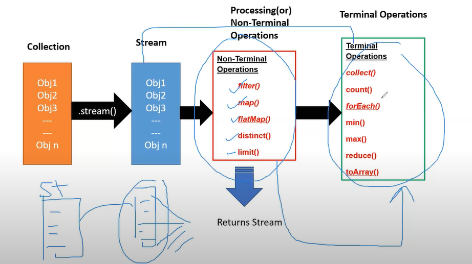

to process the data from collection we use streams concepts
# map
El método map() en Java Streams se utiliza para transformar cada elemento de un Stream
# flatmap 
El método flatMap() en Java Streams se utiliza para transformar cada elemento de un Stream en otro Stream y luego combinar todos los Streams resultantes en un solo Stream. Esto es útil cuando necesitas aplicar una función que produce un Stream para cada elemento de entrada y luego deseas tener todos los elementos resultantes en un único Stream.
# Metodos operacionales con streams
# metodos no terminales
- .distinct() este metodo elimina los objetos duplicados.
- .limit() limita la cantidad de objetos que recorre el stream.
- .filer()
- .map ()
# metdos terminales
- count() cuenta cuantos elementos hay en la lista.
- forEach () recorre la lista o la coleccion.
- min ()
- max ()

# El Parallel Stream (flujo paralelo)
permite ejecutar operaciones de Streams en paralelo, aprovechando así los múltiples núcleos de una CPU para mejorar el rendimiento en operaciones que pueden ser paralelizadas.
La forma de obtener un Parallel Stream es muy similar a un Stream regular, pero en lugar de llamar al método stream() en una colección, utilizamos el método parallelStream(). 

